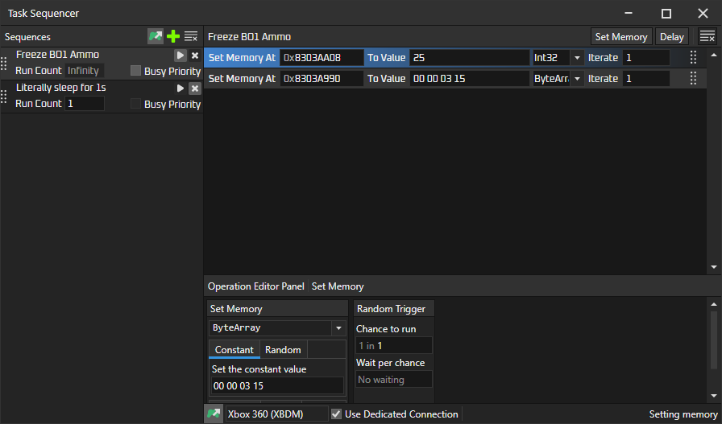

# MemEngine360 v1.1.5
This is a remake of Cheat Engine, but for consoles (so far only Xbox 360). This project was inspired by https://github.com/XeClutch/Cheat-Engine-For-Xbox-360

> Hopefully this is obvious, but please take care when changing ('poking') values on your console. 
> You may break things, maybe even permanently if you change the wrong things.

# Download and build
Clone repo: `git clone --recursive https://github.com/AngryCarrot789/MemEngine360`

Open `MemEngine360.sln` and then run/debug.

If you wish to publish as a single .exe with a few (native) DLLs alongside, run `MemEngine360/MemEngine360.Avalonia/publish.bat`. This is how I create releases for this project

> Note, if the console is already frozen when DEBUG PAUSE is enabled, it will become unfrozen after the scan finishes. Disable DEBUG PAUSE to stop this

# How to use
Visit the wiki at https://github.com/AngryCarrot789/MemoryEngine360/wiki to see the quick start guide.

## Memory Viewer
Once connected to a console, in the "Saved Addresses" panel will be a green chip. Click it, and it will show a new window.
It will automatically fill in the Address/Length fields with the Start/Length fields in your scanning options.

Then click Read All, and it will first read the data from the console (progress shown in the activity bar in main window) and then present it in the hex editor.

This also supports auto-refresh. Select a region (click+drag), then click CTRL+SHIFT+S (or click the north-west arrow button) and it will update the two text fields (optionally you 
can manually enter a range). Then, click `Start Auto Refresh`, and it will refresh the values 10 times per second. Note, you cannot scan or refresh results/saved addresses in the main UI during auto-refresh.

You can write values back to the console in the Data Inspector panel (e.g. write an int or a double, but not chars at the moment). The field you're writing into will not be refreshed until you click away from it (e.g. click anywhere in the hex editor) 

## Remote Controls (xbox only so far)
There's a few remote control commands you can find in the `Remote Controls` menu. Some of which are:
- `Open Disk Tray` - Opens the console's disk tray (cannot be closed remotely since xbdm does not implement closing...???)
- `Debug Freeze` - Freezes the console
- `Debug Unfreeze` - Unfreezes the console
- `Soft Reboot` - Reboots the current title
- `Cold Reboot` - Fully reboots the console (shows the xbox boot animation)
- `Shutdown` - Tells the console to shut down

## Task Sequencer
 `File > Open Sequencer` The task sequencer system allows you to run small operations as a large task, such as setting the values at specific addresses, waiting X amount of time, and hopefully more in the future. 

> You probably want to enable "Use Dedicated Connection", so that you can do other things in the meantime, because otherwise you won't be able to scan, change values, etc. anywhere else, since it clogs up the engine's main connection

You can add operations by clicking the buttons in the top-right corner. So far, only setting memory and delay are available.

`Busy Priority` is an option that lets a sequence run without interruptions from other parts of the application, e.g. scanning or the memory viewer. But by doing this, is stops those from working until the sequence stops. Enable this option if you really need the task to run pretty accurately with real time

> Note, all sequences not using dedicated connections will be stopped when you change connections (CTRL+O)

## Module Viewer
`File > Show Modules`. It presents all the modules and specific details, such as base address, entry point, sections, etc.

# What is...
### "Waiting for busy operations..." and Busy Tokens
This means that something else is using the engine elsewhere (scan is running, the hex editor auto-refresh is running, or maybe the results list/saved addresses are being refreshed).

This application is multithreaded, but connections are not thread safe, so there exists a `BusyToken` to synchronize access. This message is shown in the status bar while waiting to obtain the token.

# Contributions
are most welcome! Even just general tips and advice on how the UI can be improved or made more productive are helpful.

Here are some helpful pages that describe the inner workings of the PFXToolKitUI and MemEngine360.

[API, plugins, projects and codebase](docs/Projects-and-Codebase.md)

[Models, Binding, Where is MVVM?](docs/Models-And-Binding.md)

[Command system, Context Menu System, Shortcuts](docs/Command-System.md)

[Opening Custom Windows](docs/Opening-Windows.md)

[The basic dialogs (input, message, etc.)](docs/Basic-Dialogs.md)

# Licence
The project is licenced under GPLv3. See COPYING.GPLv3 for more information. All files should contain the licence header

This project references a project called PFXToolKitUI licenced under LGPL, and AvaloniaHex is licenced under MIT 