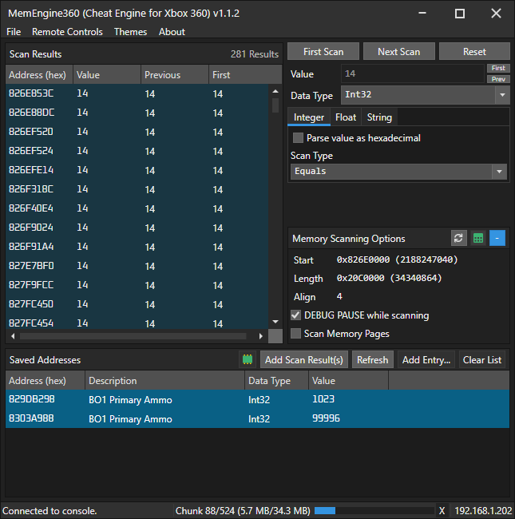
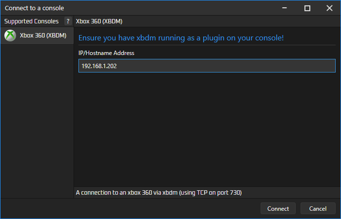
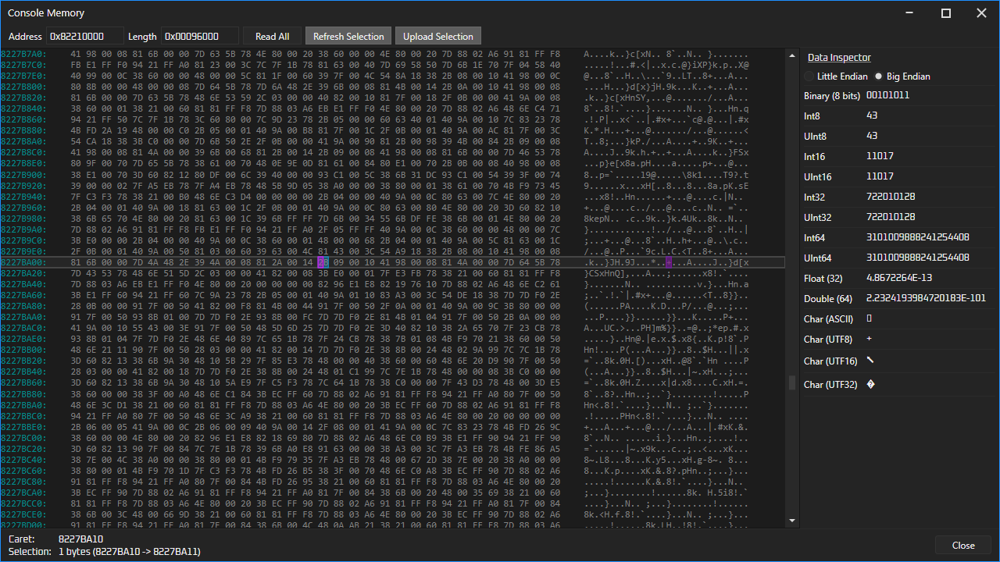

# MemEngine360 v1.1
This is a remake of Cheat Engine, but for consoles. 

This project was inspired from https://github.com/XeClutch/Cheat-Engine-For-Xbox-360

# Download and built
Clone repo: `git clone --recursive https://github.com/AngryCarrot789/MemEngine360`
Open `MemEngine360.sln` and build/run 

# How to use
Press `CTRL + O` (or go to `File > Connect to console...`). A dialog pops up allowing you to connect to different consoles. 
So far, only the Xbox 360 is implemented, however, plugins are supported to add more.

In the case you want to connect to an xbox 360, just supply its IP address in the text field and click `Connect`

You'll see in the bottom right corner a progress bar will sometimes appear. They represent 'Activities', such as read/write operation status, scan status, and more.
You can click that area to open a window which shows all activities.

## Scanning
- Enter a value in the `Value` field
- Select the data type you wish to scan for (e.g. Byte, Int32, String)
- Specify search options such as the `Scan Type` (match equal values, less than, between and more), and string type (ASCII, UTF32, etc.)

Then, specify a start address in the `Memory Scanning Options` panel and also how many bytes you want to read (default is `0x10000000` or 256MB). 

On supported consoles, you can click the little green table button to open a dialog, which lets you select a memory region to scan.
Click any of the column headers to sort them (e.g. sort by region size and look for the bigger ones; that's where the games usually are, usually after base address 0x80000000)

- DEBUG PAUSE will freeze the console during scan (speeds up scan and useful if you don't want values to change during scan). Only works on consoles supporting freezing (including Xbox 360) 
- Scan Memory Pages will scan the console's memory regions rather than blindly scan the entire search range. Only works on consoles supporting memory region querying (including Xbox 360)
- Align... code explains it better: `for (addr = start; addr < end; addr += align) /* scan addr */`

### First Scan

Then finally, click `First Scan`. The activity status (bottom right) shows the scan progress. You can cancel the scan by clicking the X.

The activity bar will show something like `Region a/b (c/d)`. This means it's processing memory region A out of B, and has read C out of D bytes from the console. It may also say `Chunk` when Scan Memory Pages is off, since we read in chunks of 64K 

Then, once the scan is complete, it may show `Updating result list...`. This is where it adds the results into the UI at a steady pace to prevent the UI freezing (rate of about 2000/s (system performance dependent)). It shows how many results are pending at the top.

> You can cancel the activity once it shows `Updating results list`, and the rows become 'Hidden', but they will still be processed next scan along with the rows in the UI.

### Next Scan

Then, if you want to check if any results' current value have changed, click `Next Scan` and it will read the current value of all results
and compare it to the value field(s) and remove any results that no longer match (because the value changed)

There are 2 additional options during next scan: `First` and `Prev`, to the right of the value field. These toggle whether to use the result rows' First value or Previous Value as a search value, instead of using the value field. 

## Saved addresses
If you wish to keep an eye on specific addresses, you can add entries in here. 

You can select results in the scan results panel, then click `Add Scan Result(s)` in the Saved Addresses panel to automatically add them. 

Or, you can add them manually by clicking `Add Entry`. Then, double click cell in the `Data Type` column (it says `Byte` by default), which
shows a popup to modify the data type. You can specify the length of a string in here too if you specify the data type as string.

## Changing values
You can double click the cell in the `Value` column(s) to modify that cell. 
You can also select multiple rows and click `CTRL + E` to modify the value of all of them.

## Copying scan results
Select any number of scan results and press `CTRL + C`. A dialog will show the results formatted in CSV

## Deleting rows
Select any scan result or saved address rows and press the Delete key to remove them.

## Memory Viewer
Once connected to a console, in the "Saved Addresses" panel will be a green chip. Click it, and it will show a new window.
It will automatically fill in the Address/Length fields with the Start/Length fields in your scanning options.

Then click Read All, and it will first read the data from the console (progress shown in the activity bar in main window) and then present it in the hex editor.

### Remote Controls (xbox only so far)
There's a few remote control commands you can find in the `Remote Controls` menu. These include:
- `Open Disk Tray` - Opens the console's disk tray (cannot be closed remotely since xbdm does not implement closing...???)
- `Debug Freeze` - Freezes the console
- `Debug Unfreeze` - Unfreezes the console
- `Soft Reboot` - Reboots the current title
- `Cold Reboot` - Fully reboots the console (shows the xbox boot animation)
- `Shutdown` - Tells the console to shut down

# Plugins
MemEngine360 supports custom plugins! If you don't care, feel free to ignore below this line.

I'd recomment using the Xbox360-XBDM's `.csproj` as an example of what to put in your plugin project. This way, it automatically copies
your plugin's DLL into the `Plugins` folder in the solution folder. The avalonia project automatically copies
the `Plugins` folder into the output directory, so no need to manually copy files around.

However, you have to manually click build for your plugin project when you make changes before running the app, because it won't 
do it automatically (since the project is seen as basically unused since it's not referenced by anything)

The most important thing is having a class extend `PFXToolKitUI.Plugins.Plugin` in your plugin project.

For more info on the Plugins API, I recommend skimming through at least the first link, and then 2nd if you want to add custom commands to the UI

- https://github.com/AngryCarrot789/FramePFX/blob/master/docs/Plugins.md
- https://github.com/AngryCarrot789/FramePFX/blob/master/docs/Command%20System%20and%20Shortcuts.md

Some of it is completely unrelated to this project, but it explains things such as PersistentConfigurations, custom commands, brushes API, configuration options, and more.
