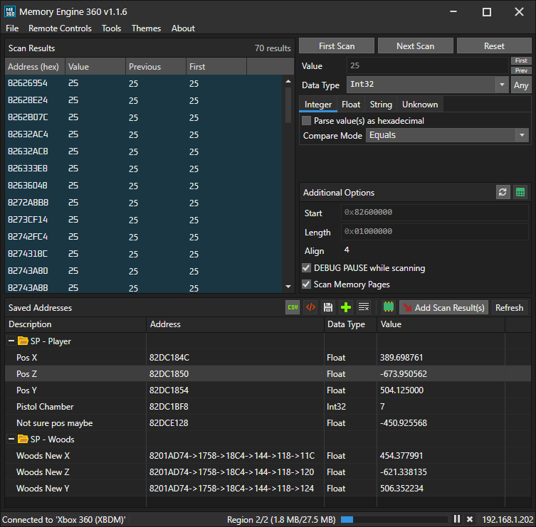

#  Memory Engine 360
This is a remake of Cheat Engine, but for consoles. This project was inspired by https://github.com/XeClutch/Cheat-Engine-For-Xbox-360

### Additional Features (via Tools menu)
- Task Sequencer (e.g. memory freezing, randomization, etc.)
- Debugger (WIP) (thread and register exploring)
- Pointer Scanner
- Memory Viewer (hex editor)
- Lua Scripting with JRPC support

> Please take care when changing ('poking') values on your console. 
> You may break things, maybe even permanently if you change the wrong things.

# Download and build
- Clone repo: `git clone --recursive https://github.com/AngryCarrot789/MemEngine360`
- Open `MemEngine360.sln` and then run/debug.

If you wish to publish as a single .exe with a few (native) DLLs alongside, run `publish.bat` in the folder `MemEngine360.Avalonia`. This is how I create releases for this project

The current version is v1.1.8-dev. Dev builds most definitely have bugs.

# How to use
Visit the wiki at https://github.com/AngryCarrot789/MemoryEngine360/wiki to see the quick start guide, as well as docs for developers that wish to improve MemoryEngine360.

# PS3
`CCAPI.dll` is not shared in this project, so you must download it yourself. However, when connecting via `CCAPI` in the Open Connection window, it will open a link to **enstoneworld.com** and download the latest supported version, and then prompt you to specify the location of the .rar file. It will then be automatically unzipped and `CCAPI.dll` will be placed in the same folder as `MemoryEngine360.exe`

# Contributions
are most welcome! Even just general tips and advice on how the UI can be improved or made more productive are helpful.

The API section of the wiki contains a lot of docs on the code base of MemoryEngine360. https://github.com/AngryCarrot789/MemoryEngine360/wiki/API

# Licence
The project is licenced under GPLv3. See COPYING.GPLv3 for more information. All files should contain the licence header

This project references a project called PFXToolKitUI licenced under LGPL, and AvaloniaHex is licenced under MIT.

The files `IFeatureXboxJRPC2.cs` and `Jrpc2FeaturesImpl.cs` contain code adapted from XboxChef/JRPC, licenced under GPL-3.0