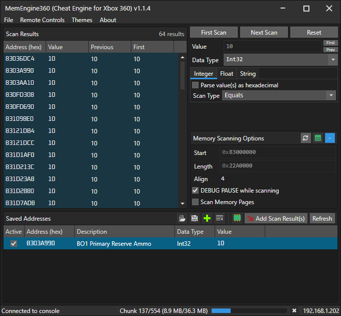
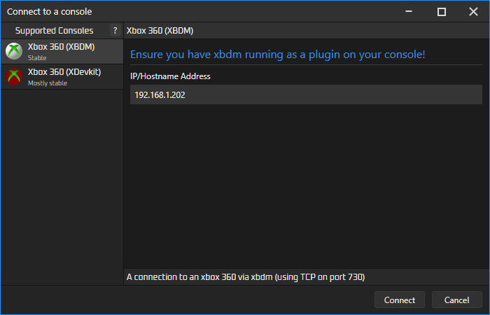
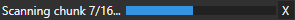
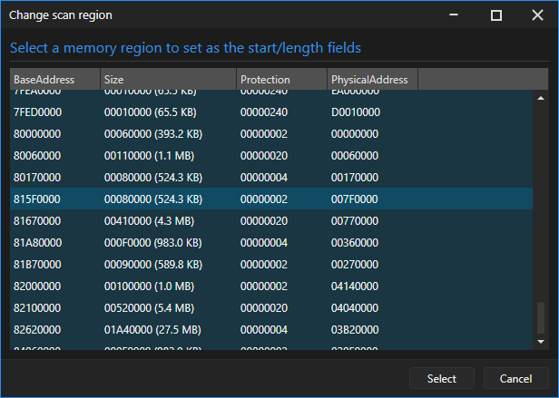
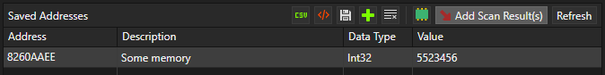
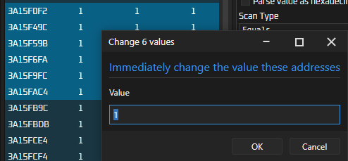
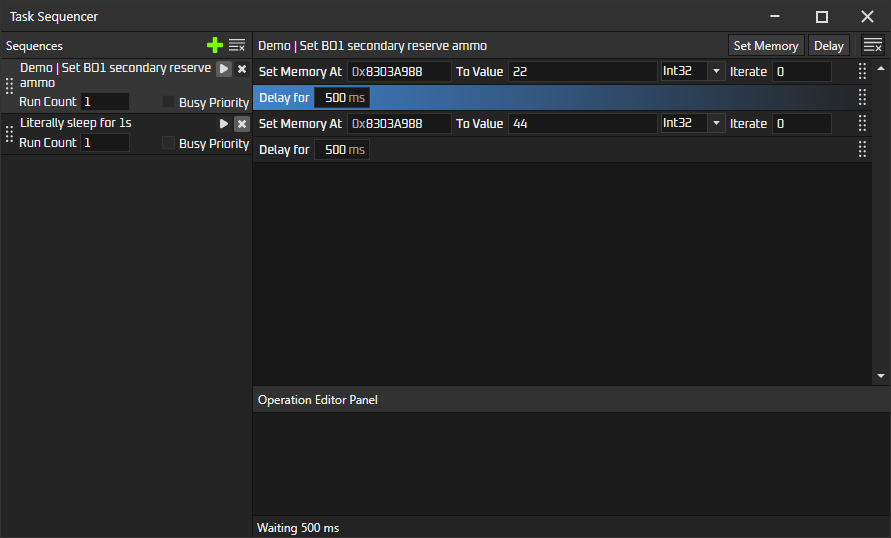
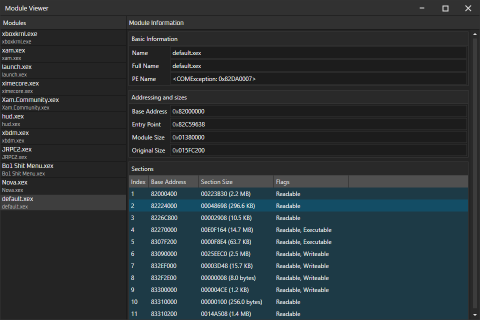

# MemEngine360 v1.1.4
This is a remake of Cheat Engine, but for consoles (so far only Xbox 360). This project was inspired by https://github.com/XeClutch/Cheat-Engine-For-Xbox-360

> Hopefully this is obvious, but please take care when changing ('poking') values on your console. 
> You may break things, maybe even permanently if you change the wrong things.

# Download and build
Clone repo: `git clone --recursive https://github.com/AngryCarrot789/MemEngine360`

Open `MemEngine360.sln` and then run/debug.

If you wish to publish as a single .exe with a few (native) DLLs alongside, run `MemEngine360/MemEngine360.Avalonia/publish.bat`. This is how I create releases for this project

# How to use
First, connect to a console by clicking `CTRL + O` in the main window (or go to `File > Connect to console...`). 
A dialog pops up allowing you to connect to different consoles. So far, only the Xbox 360 is implemented, however, plugins are supported to add more.

In the case you want to connect to an xbox 360, just supply its IP address in the text field and click `Connect`

You'll see in the bottom right corner a progress bar will sometimes appear. They represent 'Activities', such as read/write operation status, scan status, and more.
You can click that area to open a window which shows all activities.

## Scanning
- Enter a value in the `Value` field (or both fields if scan type is `Between`)
- Select the data type you wish to scan for (e.g. Byte, Int32, String)
- Specify search options such as the `Scan Type` (match equal values, less than, between and more), and string type (ASCII, UTF32, etc.)

Then, specify a start address in the `Memory Scanning Options` panel and also how many bytes you want to read (default is `0x1000000` or 16MB). 

On supported consoles, you can click the little green table button to open a dialog, which lets you select a memory region to scan.
Click any of the column headers to sort them (e.g. sort by region size and look for the bigger ones; that's where the games usually are, usually after base address 0x80000000)

- DEBUG PAUSE will freeze the console during scan (speeds up scan and useful if you don't want values to change during scan). Only works on consoles supporting freezing (including Xbox 360) 
- Scan Memory Pages will scan the console's memory regions rather than blindly scan the entire search range. Only works on consoles supporting memory region querying (including Xbox 360). You should keep this enabled for faster scanning
- Align... code explains it better: `for (addr = start; addr < end; addr += align) /* scan addr */`

> Note, if the console is already frozen when DEBUG PAUSE is enabled, it will become unfrozen after the scan finishes. Disable DEBUG PAUSE to stop this

### First Scan

Click `First Scan`. The activity status (bottom right) shows the scan progress. You can pause or cancel at any time. 

The activity bar will show something like `Region a/b (c/d)`. This means it's processing memory region A out of B, and has read C out of D bytes from the console. It may also say `Chunk` when Scan Memory Pages is off, since we read in chunks of 64K 

Then, once the scan is complete, it may show `Updating result list...`. This is where it adds the results into the UI at a steady pace to prevent the UI freezing (rate of about 2000/s (system performance dependent)). It shows how many results are pending at the top.

> You can cancel the activity once it shows `Updating results list`, and the rows become 'Hidden', but they will still be processed next scan along with the rows in the UI.

### Next Scan

This removes scan results whose current value does not match the search query. 

For example, in COD you run First and Next scan for "25" (that being an ammo count), but after first scan, you shot rounds, so the value became 24, and therefore won't show up in the next scan as you're searching for 25. 

There are 2 buttons `First` and `Prev` next to the value field. These toggle whether to use the scan results' First Value or Previous Value as a search value, instead of using the search query. 

For example, say you want to find results whose values changed relative to the previous scan (includes first and all subsequent next scans), Select `Prev` and set the `Scan Type` to `NotEqual` 

## Saved addresses

If you wish to keep an eye on specific addresses, you can add entries in here.

- Select results in the scan results panel, then click `Add Scan Result(s)` to automatically add them. 
- Add them manually by clicking the green `+` button. It will open two dialogs to configure the row.
- You can open/save an XML file containing saved addresses (or CSV if you wish).

The refresh button manually refreshes the values. This is done automatically every second by default (changeable in preferences; CTRL+ALT+S)

## Changing values
You can double click the cell in the `Value` column(s) to modify that cell. 
You can also select multiple rows and click `CTRL + E` to modify the value of all of them.

## Copying scan results
Select any number of scan results and press `CTRL + C`. A dialog will show the results formatted in CSV

## Deleting rows
Select any scan result or saved address rows and press the Delete key to remove them.

## Memory Viewer
Once connected to a console, in the "Saved Addresses" panel will be a green chip. Click it, and it will show a new window.
It will automatically fill in the Address/Length fields with the Start/Length fields in your scanning options.

Then click Read All, and it will first read the data from the console (progress shown in the activity bar in main window) and then present it in the hex editor.

This also supports auto-refresh. Select a region (click+drag), then click CTRL+SHIFT+S (or click the north-west arrow button) and it will update the two text fields (optionally you 
can manually enter a range). Then, click `Start Auto Refresh`, and it will refresh the values 10 times per second. Note, you cannot scan or refresh results/saved addresses in the main UI during auto-refresh.

You can write values back to the console in the Data Inspector panel (e.g. write an int or a double, but not chars at the moment). The field you're writing into will not be refreshed until you click away from it (e.g. click anywhere in the hex editor) 

## Remote Controls (xbox only so far)
There's a few remote control commands you can find in the `Remote Controls` menu. Some of which are:
- `Open Disk Tray` - Opens the console's disk tray (cannot be closed remotely since xbdm does not implement closing...???)
- `Debug Freeze` - Freezes the console
- `Debug Unfreeze` - Unfreezes the console
- `Soft Reboot` - Reboots the current title
- `Cold Reboot` - Fully reboots the console (shows the xbox boot animation)
- `Shutdown` - Tells the console to shut down

## Task Sequencer
The task sequencer system allows you to run small operations as a large task. The system is still WIP,
and in the future, will support many more customisations, e.g. randomly allow or disallow operations to run,
random delay times, etc.

In this example, we set 0x8303A988 to an int value of 22, wait 2 seconds, set the value to 44, and wait 1 second.

You can add operations by clicking the buttons in the top-right corner. So far, only setting memory and delay are available.

`Busy Priority` is an option that lets a sequence run without interruptions from other parts of the application, e.g. scanning or the memory viewer. But by doing this, is stops those from working until the sequence stops. Enable this option if you really need the task to run pretty accurately with real time

> Note, all sequences will be stopped when you change the connection type (CTRL+O)

## Module Viewer
This is only available via the XDevkit connection type. It can be opened in `Remote Controls > Show Modules`. It presents all the modules and specific details, such as base address, entry point, sections, etc.

# What is...
### "Waiting for busy operations..." and Busy Tokens
This means that something else is using the engine elsewhere (scan is running, the hex editor auto-refresh is running, or maybe the results list/saved addresses are being refreshed).

This application is multithreaded, but connections are not thread safe, so there exists a `BusyToken` to synchronize access. This message is shown in the status bar while waiting to obtain the token.

# Contributions
are most welcome! Even just general tips and advice on how the UI can be improved or made more productive are helpful.

Here are some helpful pages that describe the inner workings of the PFXToolKitUI and MemEngine360.

[API, plugins, projects and codebase](docs/Projects-and-Codebase.md)

[Models, Binding, Where is MVVM?](docs/Models-And-Binding.md)

[Command system, Context Menu System, Shortcuts](docs/Command-System.md)

[Opening Custom Windows](docs/Opening-Windows.md)

[The basic dialogs (input, message, etc.)](docs/Basic-Dialogs.md)

# Licence
The project is licenced under GPLv3. See COPYING.GPLv3 for more information. All files should contain the licence header

This project references a project called PFXToolKitUI licenced under LGPL, and AvaloniaHex is licenced under MIT 