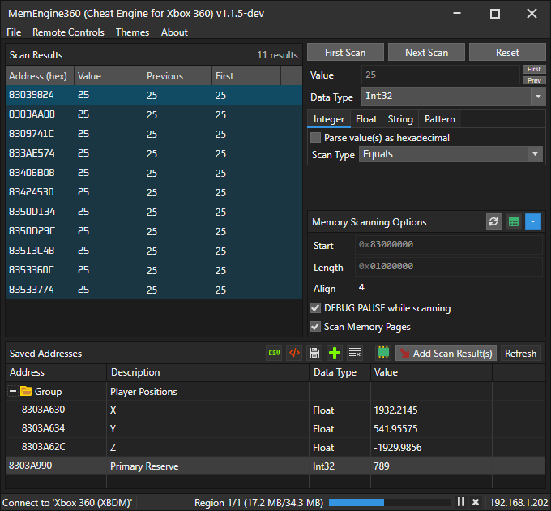

#  Memory Engine 360 v1.1.6-dev
This is a remake of Cheat Engine, but for consoles (so far only Xbox 360). This project was inspired by https://github.com/XeClutch/Cheat-Engine-For-Xbox-360

> Hopefully this is obvious, but please take care when changing ('poking') values on your console. 
> You may break things, maybe even permanently if you change the wrong things.

# Download and build
- Clone repo: `git clone --recursive https://github.com/AngryCarrot789/MemEngine360`
- Open `MemEngine360.sln` and then run/debug.

If you wish to publish as a single .exe with a few (native) DLLs alongside, run `publish.bat` in the folder `MemEngine360.Avalonia`. This is how I create releases for this project

# How to use
Visit the wiki at https://github.com/AngryCarrot789/MemoryEngine360/wiki to see the quick start guide, as well as docs for developers that wish to improve MemoryEngine360.

# Contributions
are most welcome! Even just general tips and advice on how the UI can be improved or made more productive are helpful.

The API section of the wiki contains a lot of docs on the code base of MemoryEngine360. https://github.com/AngryCarrot789/MemoryEngine360/wiki/API

# Licence
The project is licenced under GPLv3. See COPYING.GPLv3 for more information. All files should contain the licence header

This project references a project called PFXToolKitUI licenced under LGPL, and AvaloniaHex is licenced under MIT 