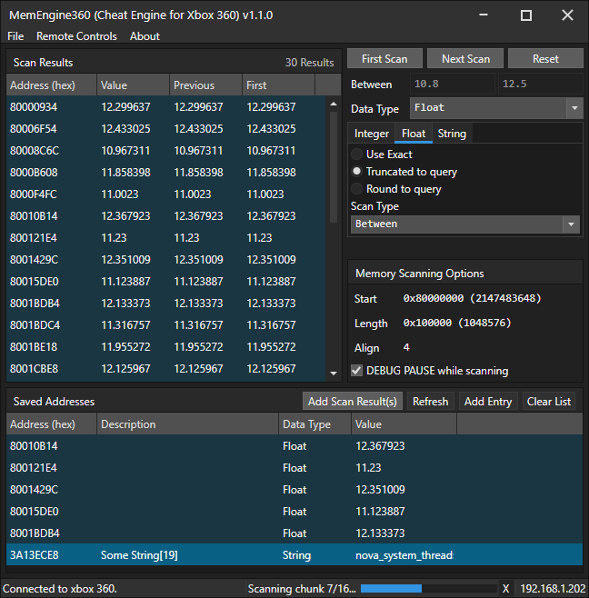
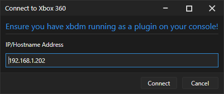

# MemEngine360 v1.1
This is a remake of Cheat Engine, but for consoles. Currently, only the Xbox360 is supported. Still WIP

This project was inspired from https://github.com/XeClutch/Cheat-Engine-For-Xbox-360

# How to use
Your console needs to be running xmdb. Press `CTRL + O` or go to `File>Connect to console`. Specify the console's IP address and click `Connect`

A dialog will popup with some information about your console, such as debug name and all threads running

You'll see in the bottom right corner a progress bar will sometimes appear. That represents 'Activities' (a PFX framework thing), 
such as connection status, read/write operation status, scan status, and more.

### Scanning
Enter a value in the `Value` field, select the data type you wish to scan for (e.g. Byte, Int32, String), then below that, you can 
specify search options such as the `Scan Type` (match equal values, less than, between and more), and string type (ASCII, UTF32, etc.)

Then, specify a start address in the `Memory Scanning Options` panel and also how many bytes you want to read (default is 0x10000 or 65536 bytes).
If you wish, you can enable DEBUG PAUSE which will freeze the xbox during scan (useful if you don't want values to change during scan).

Then, click `First Scan`. The activity status (bottom right) shows the scan progress. 
- `Reading chunk x/x` - We read data from the console in chunks of 65536 bytes. So if you scan for 200,000 bytes, it requires 4 chunks to be read
- `Scanning chunk x/x` - The program is scanning for the value in the chunk. This is typically extremely fast compared to Reading Chunk so it will only flash for a split second
- `Updating result list...` - To prevent the UI freezing if 100000s of results are found, results are added to the list at a rate of about 2000/s (system performance dependent). This shows if there's a huge number results found after the scan has completed

Then, if you want to check if any results' current value have changed, click `Next Scan` and it will do basically the same
thing as the first scan, except it scans the results in your current result list, rather than scanning the configured memory region

### Saved addresses
If you wish to keep an eye on specific addresses, you can add entries in here. 

You can select results in the scan results panel, then click `Add Scan Result(s)` in the Saved Addresses panel to automatically add them. 

Or, you can add them manually by clicking `Add Entry`. Then, double click cell in the `Data Type` column (it says `Byte` by default), which
shows a popup to modify the data type. You can specify the length of a string in here too if you specify the data type as string.

### Changing values
You can double click the cell in the `Value` column in both the scan results panel and saved addresses panel. In the scan results panel,
you can select multiple entries and click CTRL+E to modify the value of all entries. Currently not supported in the saved address panel

### Remote Controls
There's a few remote control commands you can find in the `Remote Controls` menu. These include:
- `Open Disk Tray` - Opens the console's disk tray (cannot be closed remotely)
- `Debug Freeze` - Freezes the console
- `Debug Unfreeze` - Unfreezes the console
- `Soft Reboot` - Reboots the current title
- `Cold Reboot` - Fully reboots the console (shows the xbox boot animation)
- `Shutdown` - Tells the console to shutdown
